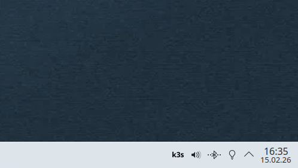

# K3s Status Tray (KDE/Plasma)
A small system tray tool for **K3s** on Linux (tested with **CachyOS KDE6/Plasma 6**) that displays the **K3s service status** and allows you to **start / stop / restart** the cluster via menu.
- Status check: `systemctl is-active k3s`
- Actions: `pkexec systemctl start|stop|restart k3s`
- UI: PyQt6 System Tray Icon + Context Menu
---
## Features
- 🟢 Running / 🔴 Stopped / 🟡 Unknown
- Context menu:
  - Start K3s
  - Stop K3s
  - Restart K3s
  - Quit
- Optional autostart via `.desktop` file
- KDE Start Menu entry
---
## Requirements
### System
- Linux with `systemd` (K3s running as `k3s` service)
- `pkexec` (PolicyKit) for privileged `systemctl` commands
- **Tested on:** CachyOS with KDE Plasma 6
### Python
- Python 3
- PyQt6: `pip install PyQt6`
- For SVG support: `python3-pyqt6.qtsvg` (Debian/Ubuntu) or equivalent package
---
## Demo 

---
## Installation
### 1. Place files
```
~/.local/share/k3s-status-tray/
├── k3s-status-tray.py          # Main script
└── k3s-status-tray.svg         # Icon/Logo
```
**Commands:**
```bash
mkdir -p ~/.local/share/k3s-status-tray
cd ~/.local/share/k3s-status-tray
# Copy files here (k3s-status-tray.py and k3s-status-tray.svg)
chmod +x k3s-status-tray.py
```
### 2. Desktop file (for autostart)
```
~/.config/autostart/k3s-status-tray.desktop
```
**Content:**
```ini
[Desktop Entry]
Type=Application
Name=K3s Status Tray
Comment=K3s system tray indicator
Exec=/usr/bin/python3 /home/YOUR_USERNAME/.local/share/k3s-status-tray/k3s-status-tray.py
Icon=/home/YOUR_USERNAME/.local/share/k3s-status-tray/k3s-status-tray.svg
Terminal=false
Categories=System;Monitor;
X-KDE-autostart-after=panel
```
**Important:** Replace `YOUR_USERNAME` with your actual username!
**Commands:**
```bash
nano ~/.config/autostart/k3s-status-tray.desktop
# Paste content, adjust paths, save
```

### 3. KDE Start Menu Entry (optional)
To add the app to your KDE Start Menu (Application Launcher):

**File location:**
```
~/.local/share/applications/k3s-status-tray.desktop
```

**Content:**
```ini
[Desktop Entry]
Type=Application
Name=K3s Status Tray
Comment=K3s system tray indicator
Exec=/usr/bin/python3 /home/YOUR_USERNAME/.local/share/k3s-status-tray/k3s-status-tray.py
Icon=/home/YOUR_USERNAME/.local/share/k3s-status-tray/k3s-status-tray.svg
Terminal=false
Categories=System;Monitor;
Keywords=k3s;kubernetes;tray;status;
StartupNotify=true
```

**Important:** Replace `YOUR_USERNAME` with your actual username!

**Commands:**
```bash
mkdir -p ~/.local/share/applications
nano ~/.local/share/applications/k3s-status-tray.desktop
# Paste content, adjust paths, save

# Update desktop database (optional, for immediate appearance)
update-desktop-database ~/.local/share/applications
```

After this, you can find "K3s Status Tray" in your KDE Start Menu under **System** or by searching for "k3s".

---
## Manual Start
```bash
cd ~/.local/share/k3s-status-tray
python3 k3s-status-tray.py
```
---
## Repository Structure (Example)
```text
k3s-status-tray/
├── k3s-status-tray.py
├── k3s-status-tray.desktop
├── k3s-status-tray.svg
└── README.md
```
---
## Notes
- **KDE Plasma 6:** Tested and working on CachyOS
- **Icon color:** When K3s is active, the icon is colored blue `#255BA3`, when inactive it's black
- **PolicyKit:** When starting/stopping/restarting, an authentication dialog appears (pkexec)
- **Status update:** Automatically every 5 seconds
- **Start Menu:** The `.desktop` file in `~/.local/share/applications/` makes the app visible in KDE's Application Launcher
---
## License
MIT
